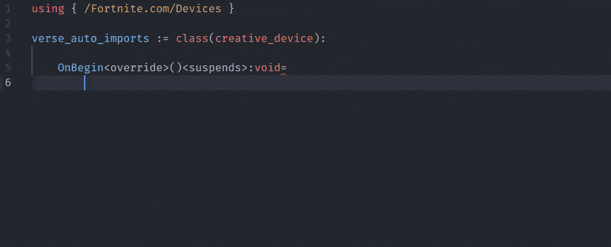

<div align="center">

**This is project is built and maintained for free for the Verse community.**
**If you find it helpful, consider supporting its development!**

<a href="https://www.paypal.com/donate/?hosted_button_id=SANPYNE27HHYA">
  
</a>
&nbsp;&nbsp;&nbsp;
<a href="https://buymeacoffee.com/vukefn">
  
</a>

</div>

---

# Verse Auto Imports

**Intelligent import management for Verse development in UEFN**

Stop manually managing imports in your Verse code. This extension automatically detects missing imports, provides smart suggestions, and keeps your code organized with zero configuration.




## Key Features

- **Automatic Import Detection** - Detects missing imports in real-time as you code
- **Multi-Option Quick Fixes** - Choose from multiple import options when VS Code finds ambiguous identifiers
- **Full Path Conversion** - Convert relative imports to full path format with CodeLens (NEW!)
- **Smart Error Recognition** - Enhanced pattern matching for various Verse compiler errors
- **Zero Configuration** - Works perfectly out of the box with sensible defaults
- **Import Organization** - Automatically sorts and consolidates imports with proper spacing
- **Flexible Configuration** - Customize behavior to match your coding style

## Quick Start

### Installation

1. Open VS Code
2. Go to Extensions (`Ctrl+Shift+X`)
3. Search for "Verse Auto Imports"
4. Click Install

### Basic Usage

Just start coding! The extension works automatically:

```verse
# Type this - you'll get an error for missing import
if(MyCharacter := Player.GetFortCharacter[]){}

# Extension automatically adds: using { /Fortnite.com/Characters }
# Or shows you quick fix options to choose from!
```

**That's it!** The extension handles the rest automatically.

## Features

### Automatic Import Detection

When you use an identifier that needs an import, like `player` or `creative_device`, the Verse compiler shows an error. The extension:

1. **Detects** the error pattern
2. **Extracts** the required import information
3. **Adds** the import automatically or **shows quick fix options**

### Multi-Option Quick Fixes

When VS Code encounters ambiguous identifiers, you get **multiple import options**:

```verse
// When you type this:
MyComponent : some_component = some_component{}

// And VS Code shows: "Did you mean any of: GameFramework.some_component, UI.Components.some_component"
// You'll see quick fix options:
// Add import: using { GameFramework } (some_component from GameFramework)
// Add import: using { UI.Components } (some_component from UI.Components)
```

**How to use:**

1. Hover over the error (red squiggly line)
2. Click the lightbulb 💡 or press `Ctrl+.`
3. Choose the import option you want

### Path Conversion (Absolute ↔ Relative)

Convert between relative and absolute import paths with a single click:

```verse
// Before: relative import
using { Textures }

// After: absolute path import
using { /creator@fortnite.com/MyProject/ProjectFiles/Textures }
```

**How it works:**
1. Hover over any import statement line
2. Click "Use absolute path" or "Use relative path" that appears above the import
3. For ambiguous modules (found in multiple locations), choose from a list
4. Or use "Use absolute paths for all" to convert all imports at once

The extension automatically detects your project's Verse path from the `.uefnproject` file.

**Dot Notation Support:**
The extension properly handles Verse's dot notation for nested modules:
- `using { HUD.Textures }` → searches for `Textures` module in `HUD` folder
- `using { UI.Components.Button }` → searches for `Button` in `UI/Components` path
- Converts to full paths like `/vuke@fortnite.com/Project/HUD/Textures`

**Module Detection:**
The extension finds both:
- **Implicit modules**: Every folder in Content/ is automatically a module
- **Explicit modules**: Code-defined using `ModuleName := module:` syntax

**Digest Modules:**
The extension skips digest modules that are already in their correct form:
- `/Fortnite.com/` modules (e.g., `/Fortnite.com/Devices`)
- `/UnrealEngine.com/` modules (e.g., `/UnrealEngine.com/Temporary/SpatialMath`)
- `/Verse.org/` modules (e.g., `/Verse.org/Simulation`)

These modules won't show the conversion CodeLens as they don't need to be converted.

**Disabling the Feature:**
If you prefer not to see the path conversion options when hovering:
1. Open the Status Bar menu (click "Auto Imports" in status bar)
2. Toggle "Path Conversion Helper" off
3. Or search for "Path Conversion" in VS Code settings (`Ctrl+,`)

### Manual Import Control

Prefer manual control? Disable auto-import and use quick fixes:

```json
{ "verseAutoImports.general.autoImport": false }
```

Then use `Ctrl+.` on any error to see import options.

### Import Location Control

**Consolidated Imports (Default):** All imports moved to the top, sorted alphabetically

```json
{ "verseAutoImports.behavior.preserveImportLocations": false }
```

**Preserved Locations:** Keep existing imports where they are, add new ones at top

```json
{ "verseAutoImports.behavior.preserveImportLocations": true }
```

### Command Palette

- **Verse: Optimize Imports** - Sort and organize all imports in current file
- **Verse: Add Import** - Add a specific import (used by quick fixes)
- **Verse: Use Absolute Path** - Convert a single import to absolute path format
- **Verse: Use Absolute Paths for All** - Convert all relative imports to absolute paths
- **Verse: Use Relative Path** - Convert a single import to relative path format
- **Verse: Use Relative Paths for All** - Convert all absolute path imports to relative paths

### Ambiguous Import Handling

Configure preferred modules for classes that exist in multiple places:

```json
{
  "verseAutoImports.behavior.ambiguousImports": {
    "vector3": "/UnrealEngine.com/Temporary/SpatialMath",
    "vector2": "/UnrealEngine.com/Temporary/SpatialMath",
    "rotation": "/UnrealEngine.com/Temporary/SpatialMath"
  }
}
```

### Experimental Features

**Digest-Based Suggestions** (opt-in): Enhanced suggestions based on official Verse API documentation

```json
{
  "verseAutoImports.experimental.useDigestFiles": true,
  "verseAutoImports.experimental.unknownIdentifierResolution": "digest_and_inference"
}
```

_Note: These features are experimental and may not always provide accurate suggestions._

## Configuration

Settings are now organized into logical sections for easier navigation. Access via `Ctrl+,` → Search "Verse Auto Imports"

### General

Core functionality settings:

| Setting                          | Default | Description                             |
| -------------------------------- | ------- | --------------------------------------- |
| `general.autoImport`             | `true`  | Enable/disable automatic importing      |
| `general.diagnosticDelay`        | `1000`  | Delay (ms) before processing errors     |

### Import Behavior

Control how imports are handled:

| Setting                          | Default      | Description                             |
| -------------------------------- | ------------ | --------------------------------------- |
| `behavior.importSyntax`          | `"curly"`    | Use `using { /Path }` or `using. /Path` |
| `behavior.preserveImportLocations` | `false`    | Keep existing imports where they are    |
| `behavior.multiOptionStrategy`   | `"quickfix"` | How to handle multiple import options   |
| `behavior.ambiguousImports`      | `{...}`      | Preferred paths for ambiguous classes   |

**Multi-Option Strategies:**
```json
{
  "verseAutoImports.behavior.multiOptionStrategy": "quickfix" // Show quick fix menu (recommended)
  // "auto_shortest"  // Automatically choose shortest path
  // "auto_first"     // Automatically choose first option
  // "disabled"       // Ignore multi-option scenarios
}
```

### Quick Fix

Quick fix menu customization:

| Setting                          | Default        | Description                             |
| -------------------------------- | -------------- | --------------------------------------- |
| `quickFix.ordering`              | `"confidence"` | Sort by confidence, alphabetical, or priority |
| `quickFix.showDescriptions`      | `true`         | Show descriptions in quick fix menu     |

### Path Conversion

Absolute/relative path conversion settings:

| Setting                          | Default | Description                             |
| -------------------------------- | ------- | --------------------------------------- |
| `pathConversion.enableCodeLens`  | `true`  | Show hover actions to convert paths     |
| `pathConversion.scanDepth`       | `5`     | Max directory depth for module scanning |

### Experimental

Experimental features (use with caution):

| Setting                                | Default      | Description                             |
| -------------------------------------- | ------------ | --------------------------------------- |
| `experimental.useDigestFiles`          | `false`      | ⚠️ Use digest files for suggestions    |
| `experimental.unknownIdentifierResolution` | `"disabled"` | ⚠️ Resolution strategy for unknown IDs |

### Advanced Configuration

All settings with their full paths:

```json
{
  "verseAutoImports.general.autoImport": true,
  "verseAutoImports.general.diagnosticDelay": 1000,
  "verseAutoImports.behavior.importSyntax": "curly",
  "verseAutoImports.behavior.preserveImportLocations": false,
  "verseAutoImports.behavior.multiOptionStrategy": "quickfix",
  "verseAutoImports.quickFix.ordering": "confidence",
  "verseAutoImports.quickFix.showDescriptions": true,
  "verseAutoImports.pathConversion.enableCodeLens": true,
  "verseAutoImports.pathConversion.scanDepth": 5,
  "verseAutoImports.experimental.useDigestFiles": false,
  "verseAutoImports.experimental.unknownIdentifierResolution": "disabled"
}
```


## Requirements

- **VS Code:** 1.85.0 or newer
- **Environment:** Working with `.verse` files in a UEFN project
- **Language Server:** Verse language support enabled

## Troubleshooting

**Extension not working?**

1. Ensure you're working with `.verse` files
2. Check that Verse language support is enabled
3. Look at Output panel: `View` → `Output` → `Verse Auto Imports`

**Wrong imports being suggested?**

1. Configure `ambiguousImports` for your preferred modules
2. Adjust `multiOptionStrategy` to get more control
3. Use manual mode with `autoImport: false`

## Contributing

Found a bug or want to contribute? We welcome issues and pull requests!

- **GitHub Repository:** [verse-auto-imports](https://github.com/VukeFN/verse-auto-imports)
- **Issues:** Report bugs and request features
- **Discussions:** Share ideas and get help

## Release Notes

### 0.6.2 (LATEST)

**Major Improvements:**

- **Configuration Reorganization**: Settings now organized into logical sections for better discoverability
  - `General`: Core functionality (auto-import, diagnostic delay)
  - `Import Behavior`: Import handling (syntax, locations, multi-option strategy)
  - `Quick Fix`: Quick fix menu customization (ordering, descriptions)
  - `Path Conversion`: Absolute/relative path conversion settings
  - `Experimental`: Experimental features (digest files)
- **Instant CodeLens Updates**: Path conversion actions now update immediately (no more 1-second delay)
- **Path Conversion Toggle**: New setting to enable/disable the path conversion helper
  - Toggle via Status Bar menu, Settings UI, or Command Palette
  - Command: `Verse: Toggle Path Conversion Helper`
- **Theme-Aware Status Bar**: Status bar tooltip now uses VS Code theme colors
  - Automatically adapts to Light, Dark, and High Contrast themes
  - Native button appearance without unsupported CSS properties

**Configuration Changes:**

Settings have been reorganized with new names (old settings will need to be updated):
- `autoImport` → `general.autoImport`
- `diagnosticDelay` → `general.diagnosticDelay`
- `importSyntax` → `behavior.importSyntax`
- `preserveImportLocations` → `behavior.preserveImportLocations`
- `ambiguousImports` → `behavior.ambiguousImports`
- `multiOptionStrategy` → `behavior.multiOptionStrategy`
- `quickFixOrdering` → `quickFix.ordering`
- `showQuickFixDescriptions` → `quickFix.showDescriptions`
- `showFullPathCodeLens` → `pathConversion.enableCodeLens`
- `fullPathScanDepth` → `pathConversion.scanDepth`
- `useDigestFiles` → `experimental.useDigestFiles`
- `unknownIdentifierResolution` → `experimental.unknownIdentifierResolution`

**New Commands:**

- `Verse: Toggle Path Conversion Helper` - Enable/disable path conversion CodeLens

**Documentation:**

- Added Buy Me a Coffee donation option
- Updated all configuration examples with new setting names
- Improved README organization with sectioned settings tables

### 0.6.1

**Bug Fixes:**

- Fixed: Built-in modules (Fortnite.com, UnrealEngine.com, Verse.org) are now properly excluded from full path conversion
- Fixed: CodeLens no longer appears on built-in module imports

### 0.6.0

**New Features:**

- **Full Path Import Conversion**: Added CodeLens support to convert relative imports to full path format
- **Project Path Detection**: Automatically detects project Verse path from .uefnproject files
- **Ambiguous Module Handling**: Smart detection and resolution when modules exist in multiple locations
- **Batch Conversion**: Convert all imports to full paths with a single command

**Improvements:**

- Added configuration options for CodeLens visibility and module scan depth
- Enhanced import path resolution with workspace-aware scanning
- Better support for UEFN project structure (Content folder detection)

### 0.5.3

**Bug Fixes:**

- Ignore ambiguous data errors suggesting 'set' syntax

### 0.5.2

**Bug Fixes:**

- Added support for "Identifier X could be one of many types" error pattern format

### 0.5.1

**Bug Fixes:**

- Added support for "Did you forget to specify one of" error pattern format

### 0.5.0

**Major New Features:**

- **Multi-Option Quick Fixes**: When VS Code shows "Did you mean any of", you now get separate import options for each possibility
- **Enhanced Error Recognition**: Improved pattern matching for various Verse compiler error formats
- **Advanced Configuration**: New settings for fine-tuning extension behavior
- **Better Import Organization**: Proper spacing and consolidation when moving imports to top
- **Experimental Digest Integration**: Optional API-based suggestions (disabled by default)

**Improvements:**

- Fixed multi-option parsing to extract correct namespaces
- Disabled experimental features by default for better stability
- Enhanced quick fix menu with confidence indicators and descriptions
- Better handling of edge cases in import organization

### 0.4.4

**Fixes and improvements:**

- Fixed detection of custom namespace patterns
- Disabled module visibility management features
- Improved error handling and diagnostics

### 0.4.3

**Bug fixes:**

- Fixed outdated error message pattern detection

### 0.4.2

**Improvements:**

- Fixed code deletion between scattered import statements
- Added `preserveImportLocations` setting
- Improved import block handling

### 0.4.1

**New features:**

- Configurable import syntax (`using { }` vs `using.`)
- Diagnostic processing delay for better performance
- Quick fix support for manual import management
- Ambiguous import handling
- Improved logging and error handling

### Earlier Versions

See [GitHub Releases](https://github.com/VukeFN/verse-auto-imports/releases) for complete changelog.

## License & Terms of Use
Copyright © 2025 VukeFN. All rights reserved.

This software and associated code files (the "Software") are
copyrighted by VukeFN and are protected by copyright law and international
treaties. VukeFN, also known as Vuke or the owner of VukeFN, holds the copyright for
this Software.

You are granted a non-exclusive, non-transferable license to use
and modify the Software for your personal, internal business, or commercial
purposes. Redistribution, resale, or sharing of the Software or any
modified versions of it is strictly prohibited without prior written
permission from VukeFN.

The Software is provided "as is", without warranty of any kind, express or
implied, including but not limited to the warranties of merchantability,
fitness for a particular purpose, or non-infringement. In no event shall
VukeFN be liable for any claim, damages, or other liability, whether in an
action of contract, tort, or otherwise, arising from, out of, or in
connection with the Software or the use or other dealings in the Software.

Unauthorized use, reproduction, redistribution, resale, or sharing of this
Software, or any derivative works, is prohibited and may result in legal
action. In the event of infringement, VukeFN may seek to recover actual
damages, any profits obtained by the infringer, and/or statutory damages
as permitted by applicable copyright law. For permissions or inquiries,
please contact VukeFN at vukefnbusiness@gmail.com or through a private
message on [X at @vukefn](https://x.com/vukefn).
